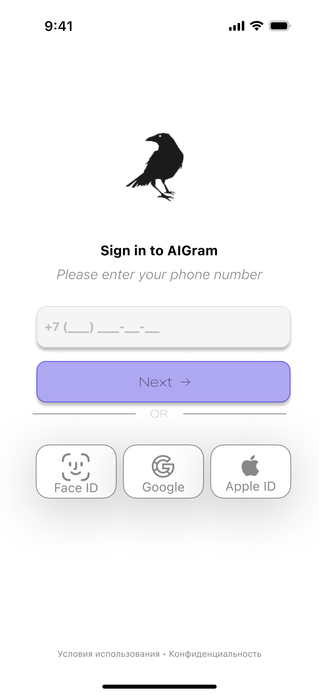
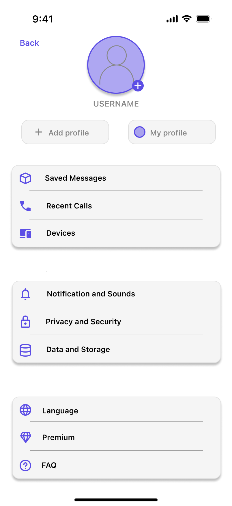
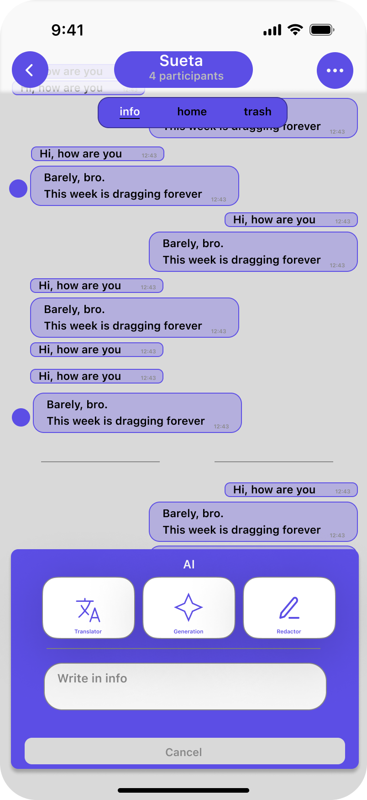

# 🎨 [AIGram]

> Минималистичный UI/UX дизайн | [🔗 Открыть в Figma](https://www.figma.com/design/4KbyVkKb9S0JQ6r4HFu8hI/FirstProject?node-id=0-1&m=dev&t=VqbVxo3dWGebZ4gS-1)

## 📱 Экраны
| Превью | Описание |
|--------|----------|
|  | Главный экран |
|  | Детали / настройки |

## 🛠 Как посмотреть
1. Открой ссылку на Figma выше
2. Используй режим `Presentation` (▶️) для интерактивного просмотра
3. Включи `Inspect` в Figma, чтобы видеть отступы и стили

---
👤 Дизайн: [Мамедов Али]  
📅 Год: 2026  
📜 Лицензия: CC BY 4.0